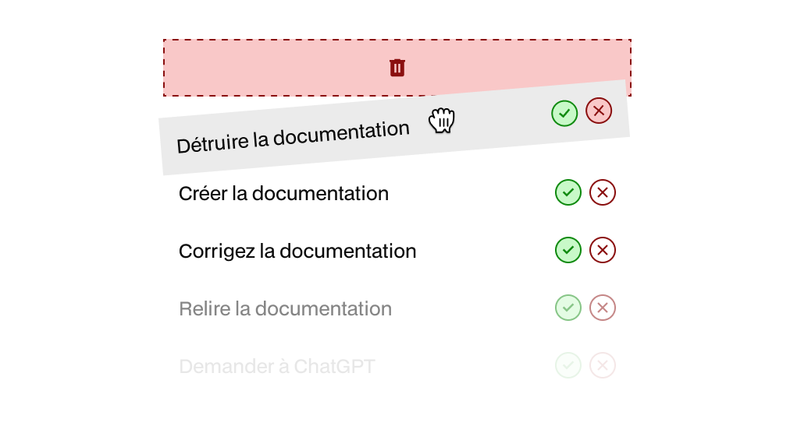

<div align="center">
  <h1>Checklist React</h1>
  
</div>

## 📋 Contexte du projet

**Checklist React** est une application de gestion de tâches interactive développée avec React. Cette application moderne permet de créer, organiser et gérer efficacement ses tâches quotidiennes avec une interface utilisateur intuitive et responsive.

L'application offre des fonctionnalités avancées :

- **Gestion complète des tâches** : Création, édition, suppression et marquage comme terminées
- **Filtrage intelligent** : Affichage des tâches en cours, terminées ou toutes
- **Recherche en temps réel** : Filtrage par mots-clés
- **Drag & Drop** : Réorganisation des tâches par glisser-déposer
- **Limite de caractères** : Contrôle de la longueur des tâches (80 caractères max)
- **Raccourcis clavier** : Navigation rapide (Ctrl+Alt+N pour nouvelle tâche)
- **Menu d'aide** : Documentation des fonctionnalités intégrée
- **Persistance des données** : Sauvegarde automatique en localStorage
- **Design moderne** : Interface épurée avec animations fluides

## 🛠️ Technologies utilisées

### Frontend

- **React 18** - Bibliothèque JavaScript pour l'interface utilisateur
- **Vite** - Outil de build rapide et serveur de développement
- **JavaScript (ES6+)** - Langage de programmation moderne
- **CSS3** - Stylisation avec variables CSS personnalisées et animations
- **HTML5** - Structure sémantique de l'application

### Outils de développement

- **ESLint** - Analyse statique du code JavaScript
- **Node.js** - Environnement d'exécution JavaScript
- **npm** - Gestionnaire de packages
- **Git** - Contrôle de version

### Fonctionnalités techniques

- **Hooks React** : useState, useEffect, useCallback, useRef
- **Custom Hooks** : useTasks pour la logique métier
- **localStorage API** : Persistance des données
- **HTML5 Drag and Drop API** : Réorganisation des tâches
- **Event Listeners** : Gestion des raccourcis clavier
- **Responsive Design** : Adaptation mobile et desktop

## Installation et configuration

### Prérequis

Avant de commencer, assurez-vous d'avoir installé :

- **Node.js** (version 16.0 ou supérieure)
- **npm** (généralement inclus avec Node.js)
- **Git** (pour le clonage du repository)

### Étapes d'installation de Node.js

1. Rendez-vous sur [nodejs.org](https://nodejs.org/)
2. Téléchargez la version LTS (Long Term Support)
3. Exécutez l'installateur et suivez les instructions
4. Vérifiez l'installation :
   ```bash
   node --version
   npm --version
   ```

### Création et configuration du projet

#### 1. Clonage du repository

```bash
# Cloner le projet
git clone https://github.com/HeyAnto/checklist-react.git

# Naviguer dans le dossier
cd checklist-react
```

#### 2. Installation des dépendances

```bash
# Installation des packages npm
npm install

# Ou avec yarn si vous l'utilisez
yarn install
```

#### 3. Configuration de l'environnement de développement

```bash
# Lancement du serveur de développement
npm run dev

# Ou
yarn dev
```

#### 4. Accès à l'application

- Ouvrez votre navigateur
- Accédez à `http://localhost:5173`
- L'application se recharge automatiquement lors des modifications

## 📱 Guide d'utilisation

### Fonctionnalités principales

#### 1. Gestion des tâches

- **Ajouter** : Cliquez sur "Ajouter une nouvelle tâche" ou `Ctrl+Alt+N`
- **Éditer** : Double-cliquez sur une tâche existante
- **Supprimer** : Cliquez sur l'icône de suppression (croix rouge)
- **Marquer terminée** : Cliquez sur l'icône de validation (coche verte)

#### 2. Organisation et filtrage

- **Filtres** : "En cours", "Terminées", "Toutes"
- **Recherche** : Tapez dans la barre de recherche pour filtrer
- **Réorganisation** : Glissez-déposez les tâches pour les réordonner

#### 3. Raccourcis clavier

| Raccourci     | Action            |
| ------------- | ----------------- |
| `Ctrl+Alt+N`  | Nouvelle tâche    |
| `Enter`       | Valider l'édition |
| `Escape`      | Annuler l'édition |
| `Double-clic` | Éditer une tâche  |

#### 4. Menu d'aide

- Cliquez sur l'icône "?" pour accéder au menu d'aide
- Documentation complète des raccourcis et fonctionnalités

### Cas d'usage suggérés

1. **Gestion quotidienne** : Créez vos tâches du jour et cochez-les au fur et à mesure
2. **Projets** : Organisez les étapes d'un projet par ordre de priorité
3. **To-do lists** : Créez des listes thématiques et filtrez selon vos besoins

## 🚧 Difficultés rencontrées et solutions adoptées

### 1. Problème : Redimensionnement des textarea sur Firefox

**Difficulté** : Les textarea ne se redimensionnaient pas correctement sur Firefox lors de l'édition des tâches.

**Solution adoptée** :

- Ajout de propriétés CSS spécifiques à Firefox (`-moz-appearance: textfield`)
- Implémentation d'un délai avec `setTimeout` pour forcer le reflow DOM
- Fonction `adjustTextareaHeight()` avec gestion de la hauteur dynamique

```javascript
const adjustTextareaHeight = () => {
  if (textareaRef.current) {
    textareaRef.current.style.height = "auto";
    textareaRef.current.style.height = "1px";
    textareaRef.current.offsetHeight; // Force Firefox reflow
    const scrollHeight = textareaRef.current.scrollHeight;
    textareaRef.current.style.height = scrollHeight + "px";
  }
};
```

### 2. Problème : Persistance des données et synchronisation d'état

**Difficulté** : Maintenir la cohérence entre l'état React et le localStorage, notamment lors des modifications multiples.

**Solution adoptée** :

- Création d'un custom hook `useTasks` pour centraliser la logique
- Synchronisation automatique avec localStorage via `useEffect`
- Gestion d'état immutable avec spread operator

```javascript
const useTasks = () => {
  const [tasks, setTasks] = useState(() => {
    const saved = localStorage.getItem("tasks");
    return saved ? JSON.parse(saved) : [];
  });

  useEffect(() => {
    localStorage.setItem("tasks", JSON.stringify(tasks));
  }, [tasks]);
};
```

### 3. Problème : Drag & Drop avec état de recherche/édition

**Difficulté** : Le drag & drop interfère avec la recherche et l'édition des tâches.

**Solution adoptée** :

- Désactivation du drag & drop pendant la recherche ou l'édition
- État conditionnel `isDragDisabled`
- Classes CSS dynamiques pour l'interface utilisateur

```javascript
const isDragDisabled = searchTerm.trim() !== "" || editingTaskId !== null;
```

### 4. Problème : Gestion des animations et performance

**Difficulté** : Les animations complexes causaient des problèmes de performance et de compatibilité.

**Solution adoptée** :

- Séparation des styles en fichiers distincts (components.css, animations.css, responsive.css)
- Utilisation de `transform` plutôt que de modifier les propriétés de layout
- Animation en cascade avec `animation-delay` calculé dynamiquement

### 5. Problème : Limite de caractères et validation

**Difficulté** : Implémenter une limite de caractères claire avec feedback visuel.

**Solution adoptée** :

- Compteur de caractères en temps réel
- Validation côté frontend avec feedback visuel (couleur rouge)
- Limitation souple permettant le dépassement temporaire pour la UX

```javascript
const remainingChars = MAX_CHARACTERS - editText.length;
const isOverLimit = editText.length > MAX_CHARACTERS;
```

---

_Développé dans le cadre de la formation Simplon - Brief React_
